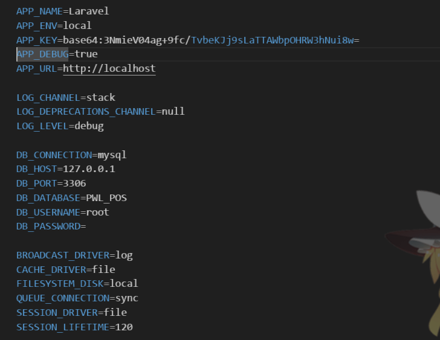
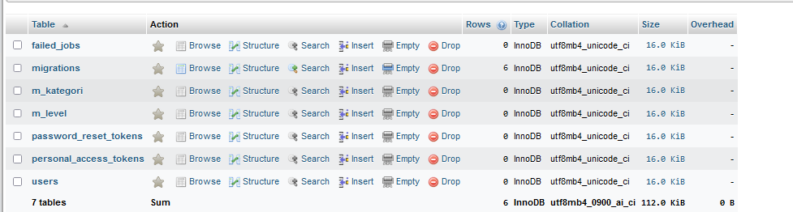

## Laporan JOBSHEET 03 MIGRATION, SEEDER, DB FAÇADE, QUERY BUILDER, dan ELOQUENT ORM

NIM : 2241720033  
Nama : Mochammad Cholilur Rokhman  
Kelas : TI-2F

### Praktikum 1 pengaturan database

#### Langkah Langkah Praktikum
   

### Praktikum 2.1 Pembuatan Migrasi tanpa relasi

#### Langkah Langkah Praktikum

  

### Operational Parameters

#### Langkah Langkah Praktikum

b.   
c.   
e. 

### Controller (Membuat Controller)

#### Langkah Langkah Praktikum

e.   

f. 

    class PageController extends Controller
    {
    public function index ()
    {
    return 'Selamat Datang';
    }

    public function about()
    {
        $nim = '2241720033';
        $nama = 'Moch. Cholilur Rokhman';

        return 'NIM : ' . $nim . ' ' .
               'Nama : ' . $nama;
    }
    public function articles($id)
    {
        return 'Halaman Artikel dengan Id ' . $id;
    }

    };

    Untuk Routingnya
    
    Route::get('/', [PageController::class, 'index']);
    Route::get('/about', [PageController::class, 'about']);
    Route::get('/articles{id}', [PageController::class, 'articles']);

g. Routing nya  

    Route::get('/', [HomeController::class, "index"]);  
    Route::get('/about', [AboutController::class, 'About']);  
    Route::get('/articles{id}', [ArticleController::class, 'articles']);

### Resource Controller

#### Langkah Langkah Praktikum

c. 

### View (Membuat View)

#### Langkah Langkah Praktikum

c. 

### View dalam direktori

#### Langkah Langkah Praktikum

c. 

### Menampilkan View dari Controller

#### Langkah Langkah Praktikum

c. 

### Meneruskan data ke View

#### Langkah Langkah Praktikum

c. 

