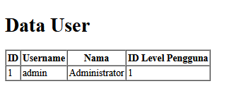
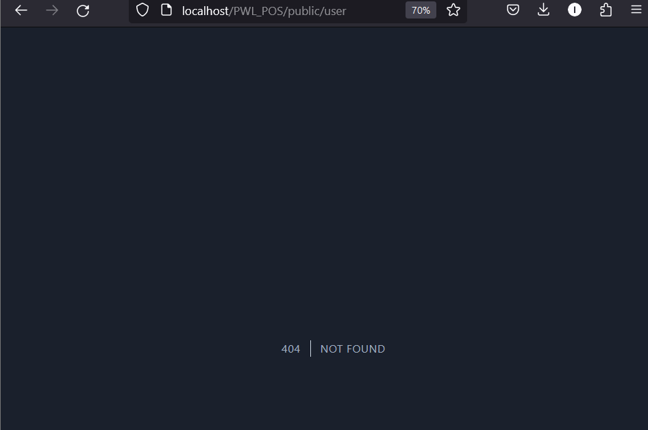

## Laporan JOBSHEET 03 MIGRATION, SEEDER, DB FAÇADE, QUERY BUILDER, dan ELOQUENT ORM

 ## JOBSHEET 04 MODEL dan ELOQUENT ORM (ada dibawah)

NIM : 2241720033  
Nama : Mochammad Cholilur Rokhman  
Kelas : TI-2F

1. Pada Praktikum 1 - Tahap 5, apakah fungsi dari APP_KEY pada file setting .env Laravel?  
   Digunakan untuk mengamankan data yang sensitif, seperti sesi pengguna dana kata sandi

2. Pada Praktikum 1, bagaimana kita men-generate nilai untuk APP_KEY?  
    Tinggal membbuka vs code lalu ke terminal kemudian ketik 'php artisan key:generate'

3. Pada Praktikum 2.1 - Tahap 1, secara default Laravel memiliki berapa file migrasi? dan untuk apa saja file migrasi tersebut?  
    3 , membuat table pengguna, table reset kata sandi, dan table failed_jobs

4. Secara default, file migrasi terdapat kode $table->timestamps();, apa tujuan/output dari fungsi tersebut?  
    Secara otomatis menambahkan dua kolom yakni 'created_at' dan 'updated_at'

5. Pada File Migrasi, terdapat fungsi $table->id(); Tipe data apa yang dihasilkan dari fungsi tersebut?  
    UnsignedBigInteger (primary key
    )
6. Apa bedanya hasil migrasi pada table m_level, antara menggunakan $table->id(); dengan menggunakan $table->id('level_id'); ?  
    $table->id(); -> Otomatis akan menamai kolom dengan nama id
    sedangkan $table->id('level_id') akan memberikan nama kolom menjadi level_id

7. Pada migration, Fungsi ->unique() digunakan untuk apa?  
    Digunakan untuk menetapkan batasan Unique pada kolom tertentu seperti kolom email

8. Pada Praktikum 2.2 - Tahap 2, kenapa kolom level_id pada tabel m_user
   menggunakan $tabel->unsignedBigInteger('level_id'), sedangkan kolom level_id pada tabel m_level menggunakan $tabel->id('level_id') ?  
   Penggunaan $table->unsignedBigInteger('level_id') pada tabel m_user adalah untuk menetapkan jenis data kolom yang sesuai untuk foreign key, sementara penggunaan $table->id('level_id') pada tabel m_level adalah untuk memberikan nama khusus untuk kolom id.

9. Pada Praktikum 3 - Tahap 6, apa tujuan dari Class Hash? dan apa maksud dari kode program Hash::make('1234');?  
    Tujuannya untuk meningkatkan keamanan dengan menyimpan kata sandi dalam bentuk hash.
    Hash::make('1234') kode ini adalah cara menggunakan kelas hash untuk mengenkripsi kata sandi.

10. Pada Praktikum 4 - Tahap 3/5/7, pada query builder terdapat tanda tanya (?), apa kegunaan dari tanda tanya (?) tersebut?  
    Digunakan sebagai parameter placehorder.

11. Pada Praktikum 6 - Tahap 3, apa tujuan penulisan kode protected $table = ‘m_user’; dan protected $primaryKey = ‘user_id’; ?  
    Untuk menentukan nama table dan primary key yang sesuai dengan model tersebut.
12. Menurut kalian, lebih mudah menggunakan mana dalam melakukan operasi CRUD ke database (DB Façade / Query Builder / Eloquent ORM) ? jelaskan  
    Menurut saya lebih muda menggunakan DB Facade karena pada DB facade 
    memberikan kontrol langsung atas query yang dijalankan ke database tanpa harus memikirkan struktur model atau ORM

## Jobsheet 4
### Praktikum 1 $fillable

1. Untuk langkah 4 dan 5 hasilnya akan eror

### Praktikum 2.1 Retriving Single Models

1. Untuk langkah 1 dan 2 akan eror

2. Untuk langkah ke 4 tidak eror karena menggunakan clausa where yang mendefinisikan kondisi 

3. Untuk langkah ke 6 juga tidak eror karena terdapat kondisi

4. Untuk langkah ke 8 hasilnya eror

5. Untuk langkah ke 10 hasilnya eror

### Praktikum 2.2 Not Found Exceptions

1. Untuk langkah ke 1 Hasilnya eror

2. Untuk langkah ke 3 Hasilnya eror karena tidak ada user namanya manager9

### Praktikum Retreiving Aggregates

1. Untuk langkah 1

2. Ubah script pada view  

